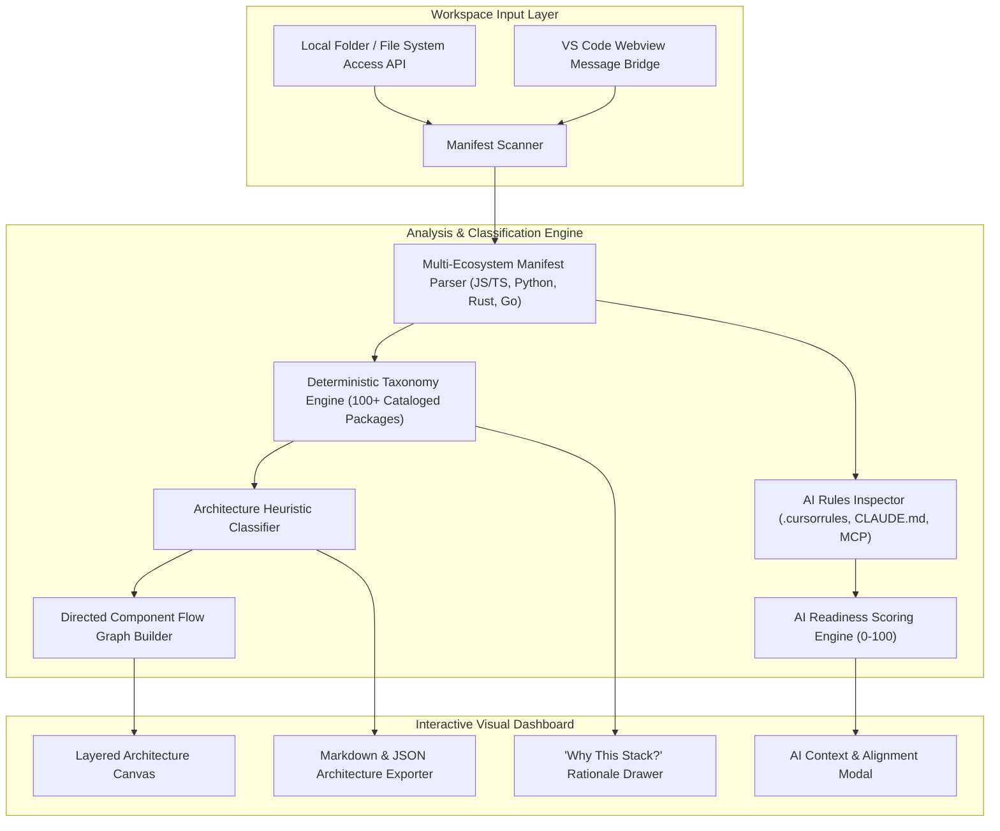

<div align="center">

# 🔍 Webdek — Codebase Architecture Visualizer & Workspace Inspector
### Interactive AST Manifest Parser, Heuristic Architecture Classifier & AI Context Readiness Engine

[](https://reactjs.org/)
[](https://www.typescriptlang.org/)
[](https://vitejs.dev/)
[](https://tailwindcss.com/)
[](https://code.visualstudio.com/)
[](https://opensource.org/licenses/MIT)

<p align="center">
  <b>Webdek</b> is a zero-runtime-overhead workspace intelligence inspector and architecture visualizer. Engineered to run as an interactive web panel or embedded <b>VS Code / Cursor webview extension</b>, Webdek parses repository manifests across 5+ language ecosystems, evaluates architectural design patterns, visualizes component dependency graphs, and grades <b>AI Agent Alignment & Readiness</b>.
</p>

[✨ Key Capabilities](#-key-capabilities) • [🏛️ System Architecture](#️-system-architecture) • [🚀 Quickstart](#-quickstart) • [🔌 VS Code Bridge](#-vs-code--antigravity-webview-bridge) • [📁 Project Structure](#-project-structure) • [🔗 Connect](#-connect--contribute)

</div>

---

## 🌟 Key Capabilities

### 1. 📦 Multi-Ecosystem AST & Manifest Parser (`src/engine/scanner.ts`)
* **Multi-Language Detection**: Deep-scans root configuration files across multiple development ecosystems:
  * **JavaScript / TypeScript**: `package.json`, `tsconfig.json`, `vite.config.ts`, `next.config.js`
  * **Python**: `pyproject.toml`, `requirements.txt`
  * **Rust**: `Cargo.toml`
  * **Go**: `go.mod`
  * **Containers & DevOps**: `docker-compose.yml`, `Dockerfile`
* **Dependency Analysis**: Dissects runtime dependencies, build pipelines (bundlers, linters, test runners), styling frameworks, and state layers.
* **AI Context Extraction**: Detects and parses AI agent instruction sets:
  * `.cursorrules` and `.cursor/rules/`
  * `CLAUDE.md` and `.claude/` system prompts
  * Model Context Protocol (MCP) server definitions (`mcp.json`)
  * Environment variable constraints (`.env.example`)

### 2. 🧠 Deterministic Taxonomy & Decision Engine (`src/engine/taxonomy.ts`)
* **100+ Library Knowledge Base**: Built-in curated catalog mapping major open-source libraries with:
  * **Plain-English Purpose**: Concise explanation of what each dependency does.
  * **Architectural Rationale**: Why teams choose this library over alternatives and its exact structural role.
  * **Criticality Levels**: Ranked by operational risk (`critical`, `high`, `medium`, `utility`).
* **Heuristic Fallback Engine**: Automatically infers the category and role of uncataloged packages based on package prefixes, scoped names (`@tanstack/*`, `@types/*`), and naming patterns.

### 3. 🏛️ Architecture Heuristic Classifier (`src/engine/architecture.ts`)
* **Pattern Recognition**: Analyzes directory hierarchies and dependency patterns to classify the application pattern:
  * **Next.js App Router Monolith** (RSC, Server Actions, Nested Routes)
  * **Client-Heavy SPA** (Vite + React/Vue + Zustand/Redux + TanStack Query)
  * **Clean / Hexagonal Architecture** (Controllers &rarr; Services &rarr; Domain &rarr; Repositories)
  * **Layered MVC** (Models &rarr; Views &rarr; Controllers)
  * **Rust / Systems Async Agent** (Tokio Runtime)
  * **Serverless / Edge Microservices**
* **Directed Flow Engine**: Generates execution lifecycles and interactive, layered component relationship graphs.

### 4. 🎛️ Interactive Visual Workspace (`src/ui/`)
* **Overview Metric Bar**: High-density badges displaying Framework, Runtime, Styling, State Management, and AI tooling.
* **Layered Architecture Graph**: Interactive canvas displaying component connectivity, directed flow lines, and detailed node inspector drawers.
* **"Why This Stack?" Drawer**: Categorized, searchable, and sortable decision drawer explaining every library's architectural significance.
* **AI Context Inspector**: Visualizes prompt rules, MCP servers, expected environment variables, and calculates an **AI Alignment & Readiness Score** (0–100).
* **Directory Layer Explorer**: Groups codebase files by their architectural layer.
* **1-Click Report Exporter**: Generates comprehensive GitHub Flavored Markdown and JSON architecture reports for PRs, onboarding, and documentation.
* **Live Workspace Picker & Presets**: Open any local directory via the HTML5 File System Access API, or switch between preloaded presets (Next.js 14 AI E-Commerce, Vite SPA, Fastify Clean Architecture).

---

## 🏛️ System Architecture



---

## 🚀 Quickstart

### Prerequisites
* **Node.js**: v18 or later
* **npm** or **yarn** / **pnpm**

---

### Development Server
```bash
# Clone the repository
git clone https://github.com/harinarayana1457-cmyk/Webdek.git
cd Webdek

# Install dependencies
npm install

# Start Vite development server
npm run dev
```
Open **`http://localhost:5173`** in your browser.

---

### Production Build
```bash
npm run build
```
The optimized production bundle will be generated in `dist/`, ready to be embedded into browser web panels or bundled as a VS Code Webview extension.

---

## 🔌 VS Code / Antigravity Webview Bridge

Webdek features a decoupled communication bridge (`src/vscode-webview.ts`). When mounted inside a VS Code or Cursor webview panel:

```typescript
import { postToHost, subscribeToHost } from './vscode-webview';

// Notify extension host that webview is mounted and ready
postToHost({ type: 'READY' });

// Listen for workspace file payloads sent from the host
subscribeToHost((event) => {
  if (event.data.type === 'WORKSPACE_FILES') {
    // Automatically triggers scanner and renders visual architecture
    console.log('Received workspace files:', event.data.payload);
  }
});
```

---

## 📁 Project Structure

```text
Webdek/
├── src/
│   ├── engine/
│   │   ├── architecture.ts        # Architectural pattern classifier & graph constructor
│   │   ├── scanner.ts             # Manifest parser (JS, Python, Rust, Go, AI rules)
│   │   ├── taxonomy.ts            # 100+ package knowledge base & heuristic inferrer
│   │   └── types.ts               # Core TypeScript data schemas & AST types
│   ├── ui/
│   │   ├── components/
│   │   │   ├── AIContextInspector.tsx   # AI readiness score & prompt rules inspector
│   │   │   ├── ArchitectureGraph.tsx    # Interactive layered dependency canvas
│   │   │   ├── DirectoryExplorer.tsx    # Layer-grouped file explorer
│   │   │   ├── ExportModal.tsx          # Markdown & JSON report exporter
│   │   │   ├── Navbar.tsx               # Workspace picker & preset selector
│   │   │   ├── OverviewBar.tsx          # High-density tech stack metric badges
│   │   │   └── WhyThisStackDrawer.tsx   # Package rationale & decision drawer
│   │   └── presets/
│   │       └── sampleProjects.ts        # Built-in Next.js, Vite & Fastify project presets
│   ├── App.tsx                    # Root dashboard application layout
│   ├── main.tsx                   # Vite DOM entrypoint
│   ├── vscode-webview.ts          # Two-way postMessage communication bridge
│   └── index.css                  # Tailwind styles & theme variables
├── index.html                     # HTML5 application shell
├── package.json                   # Project dependencies & scripts
├── tailwind.config.js             # Tailwind CSS design system configuration
├── tsconfig.json                  # TypeScript compiler settings
├── vite.config.ts                 # Vite bundler configuration
└── README.md                      # Project documentation
```

---

## 🔗 Connect & Contribute

* **Author**: [Hari Narayana (@harinarayana1457-cmyk)](https://github.com/harinarayana1457-cmyk)
* **LinkedIn**: [](https://www.linkedin.com/in/hari-narayana-035ba1389/)
* Contributions, issues, and feature requests are warmly welcomed!

---

## 📄 License

* Distributed under the **[MIT License](https://opensource.org/licenses/MIT)**.
